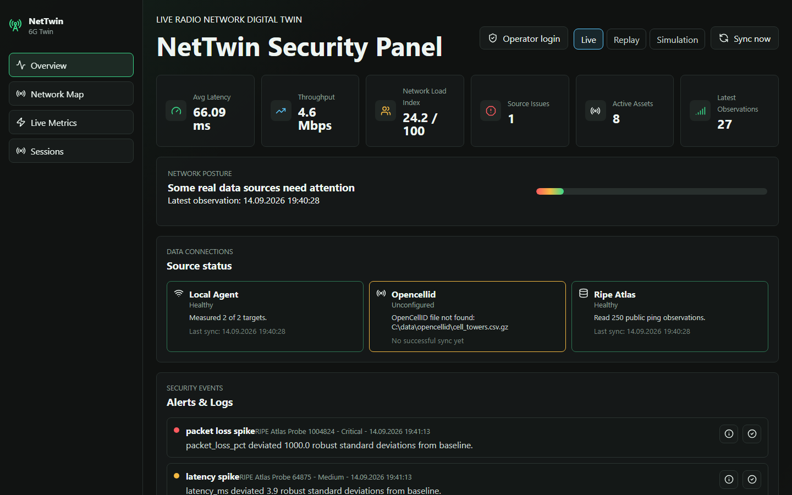
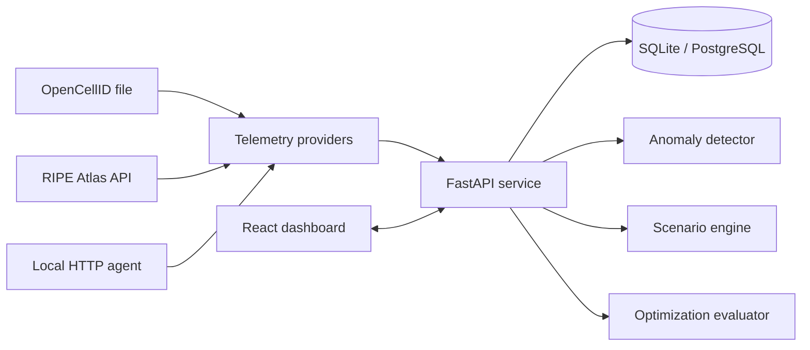

# NetTwin

NetTwin is a local-first radio network digital twin that keeps observed Internet telemetry, historical replay, and synthetic network simulation explicitly separated. It combines a FastAPI API, a React operations dashboard, anomaly detection, scenario analysis, and guarded optimization workflows in one reproducible project.

The project demonstrates production-minded full-stack engineering: data provenance, idempotent ingestion, deterministic pagination, privacy-aware exports, database migrations and backups, operator authentication, background jobs, and automated acceptance checks.



## Highlights

- **Three honest data modes:** live observations, historical replay, and isolated simulation.
- **Real telemetry adapters:** public RIPE Atlas measurements, optional OpenCellID imports, and a local HTTP latency/throughput agent.
- **Explainable detection:** robust baselines, anomaly scores, model versions, and resolution notes.
- **Safe optimization:** previewed baseline/projected state, explicit approval, stale-state rejection, and idempotent apply.
- **Research sessions:** capture local measurements, compare compatible runs, and export privacy-preserving CSV/JSON or printable reports.
- **Operational foundations:** Alembic migrations, verified SQLite backups, readiness checks, retention, tracked ingestion jobs, and CI security audits.

## Architecture



OpenCellID assets, RIPE probes, and local-agent measurements retain their own identities. NetTwin does not infer that an Internet probe belongs to a nearby cell tower. Synthetic metrics never overwrite observation labels.

## Technology

| Layer | Stack |
| --- | --- |
| API | Python 3.12, FastAPI, Pydantic, SQLAlchemy |
| Data | SQLite by default; PostgreSQL/TimescaleDB option; Alembic |
| Analytics | NumPy, robust statistical baselines, versioned load model |
| UI | React 18, Vite, Leaflet, Recharts |
| Quality | Pytest, Vitest, Playwright, pip-audit, npm audit, GitHub Actions |

## Run locally

Prerequisites: Python 3.12 and Node.js 22.

```powershell
cd backend
python -m venv .venv
.venv\Scripts\python.exe -m pip install -r requirements.txt
Copy-Item .env.example .env

cd ..\frontend
npm install

cd ..
.\start.cmd
```

Open `http://127.0.0.1:5173`. API documentation is available at `http://127.0.0.1:8000/docs`.

NetTwin works without a paid API. OpenCellID is optional and file-based. RIPE Atlas reads existing public measurements. The local agent uses configurable HTTP targets and a controlled download sample.

## Core workflows

### Live and replay

Live mode shows source health, current observations, topology, and open anomalies. Replay requests a bounded time range and reconstructs the latest state at the selected timeline position without mixing in future alerts.

### Simulation and optimization

Simulation generates seeded, reproducible scenarios and attack patterns. Optimization suggestions must be evaluated before application. An evaluation stores the baseline metric and station state; applying a stale evaluation is rejected and repeated apply requests do not duplicate state changes.

### Measurement sessions

Create a session in **Sessions**, then select **Capture now** to run the local latency/failure/throughput probe. Comparison is allowed only when both sessions contain observations from the same methods and targets. Reports include sample count, median, and p95. Location fields are excluded from exports unless explicitly requested.

### Operator access

Set `NETTWIN_OPERATOR_API_KEY` in `backend/.env`. **Operator login** exchanges the key for an eight-hour HttpOnly, SameSite cookie; the key is never embedded in the frontend bundle. Read-only dashboards remain accessible.

## Configuration

Copy [backend/.env.example](backend/.env.example) to `backend/.env`. Useful settings include:

- `OPENCELLID_CSV_PATH`: optional CSV/CSV.GZ database export.
- `RIPE_ATLAS_MEASUREMENT_IDS`: optional comma-separated public measurement IDs.
- `LOCAL_AGENT_TARGETS` and `LOCAL_AGENT_DOWNLOAD_URL`: controlled desktop probe targets.
- `NETTWIN_OPERATOR_API_KEY`: protection for mutating operations.
- `OBSERVATION_RETENTION_DAYS`: raw-observation retention; `0` keeps all records.
- `NETTWIN_DATABASE_URL`: SQLite by default or a PostgreSQL connection URL.

For self-hosted TimescaleDB:

```powershell
docker compose up -d timescaledb
Copy-Item backend\.env.timescale.example backend\.env
```

## Verification

```powershell
cd backend
.venv\Scripts\python.exe -m pytest -q
.venv\Scripts\python.exe -m pip_audit -r requirements.txt

cd ..\frontend
npm test
npm run build
npx playwright install chromium
npm run test:e2e

cd ..\backend
.venv\Scripts\python.exe -m scripts.soak_test --duration 300
```

The soak command continuously checks readiness, dashboard aggregation, and system status. Increase `--duration` to `86400` for a 24-hour acceptance run.

Before schema work, create and verify a consistent SQLite backup:

```powershell
cd backend
.venv\Scripts\python.exe -m scripts.backup_database
.venv\Scripts\alembic.exe upgrade head
```

## API surface

- `GET /api/health/ready` and `GET /api/system/status`
- `GET /api/assets`, `GET /api/observations`, and `GET /api/observations/aggregate`
- `POST /api/ingestion/sync` and `GET /api/ingestion/jobs/{id}`
- `GET|POST /api/measurement-sessions` and `POST /api/measurement-sessions/{id}/capture`
- `GET /api/measurement-sessions/compare`
- Scenario, anomaly, attack-simulation, and optimization endpoints under `/api`
